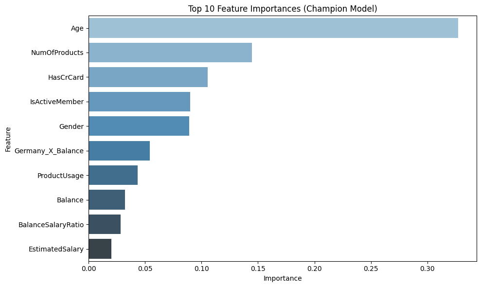

# Bank Customer Churn: Predictive Analysis

For a detailed, narrative walkthrough of this project, please see the [full case study here](./CASE_STUDY.md).

This project analyzes a dataset of 10,000 bank customers to predict churn. The goal was to move beyond reactive retention efforts and build a model that could proactively identify customers at risk of leaving, enabling the bank to implement targeted retention strategies.

## Key Findings

* The final optimized Gradient Boosting model can successfully identify 74% of all potential churners (Recall of 0.74).
* The primary drivers of churn were identified as Age, Number of Products, and a customer's Activity Level.
* Feature engineering was crucial, revealing that the account balance of German customers is a uniquely powerful predictor of churn.

## Recommendations

Based on the analysis, several key strategies were recommended:
1.  Launch an Ecosystem Deepening Campaign: Target customers with few products with offers for new services (like a credit card) to increase integration.
2.  Implement an Automated Activity Nudge: Proactively engage inactive customers with small incentives.
3.  Create a Specialized German Retention Desk: Address the unique financial concerns of at-risk German customers.

## How to Use This Repository

1.  Clone the repository: `git clone https://github.com/x59215/Bank-Churn-Predictive-Analysis.git`
2.  Install the required packages: `pip install -r requirements.txt`
3.  Navigate to the `notebooks` directory and run the `bank_churn_predictive_model.ipynb` Jupyter Notebook.

## Tools & Libraries
* Python
* Pandas
* Scikit-learn
* Imbalanced-learn
* Matplotlib & Seaborn
